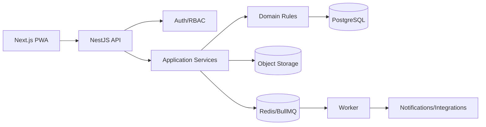
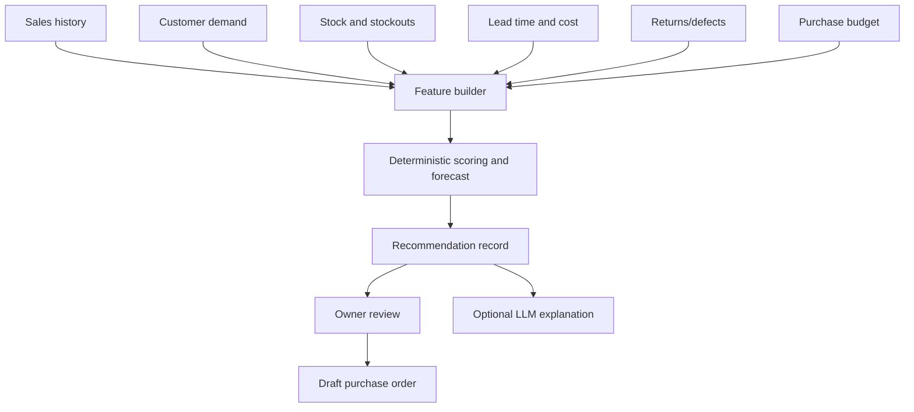
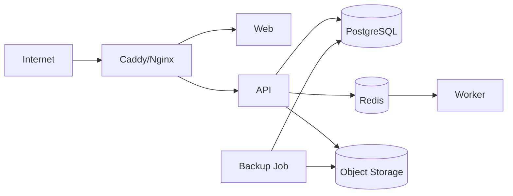

# Technical Architecture

## 1. Architecture decision

Use a **modular monolith** with clear domain boundaries.

This provides:

- one deployable business application
- strong database transactions
- lower operational burden for one developer
- easier testing and debugging
- a clean path to extract services only when real scale or team boundaries require it

Do not use microservices for the initial system.

## 2. Recommended stack

### Frontend
- Next.js with TypeScript
- React
- Tailwind CSS
- shadcn/ui or an equivalent accessible component layer
- TanStack Query for server-state workflows where useful
- React Hook Form + Zod
- PWA support
- IndexedDB only for safe drafts and temporary offline data

### Backend
- NestJS with TypeScript
- REST API with OpenAPI
- Zod or class-validator at API boundaries
- domain services for business rules
- background worker using BullMQ when needed

### Data
- PostgreSQL
- Prisma ORM and migrations
- Redis for queues, locks, rate limiting and cached aggregates only when justified
- S3-compatible object storage for photos and documents

### Infrastructure
- pnpm monorepo
- Turborepo optional
- Docker Compose
- Caddy or Nginx reverse proxy
- GitHub Actions
- managed VPS or cloud database when budget allows
- encrypted daily backups

### Quality and operations
- Vitest/Jest for unit and integration tests
- Playwright for end-to-end tests
- structured JSON logging
- Sentry or equivalent error tracking
- health checks and uptime monitoring
- OpenTelemetry later if needed

## 3. Monorepo structure

```text
mobile-shop-os/
  apps/
    web/
    api/
    worker/
  packages/
    database/
    domain/
    validation/
    ui/
    config/
    testing/
  docs/
  infra/
    docker/
    scripts/
  .github/workflows/
```

`apps/worker` can remain absent until background jobs are introduced.

## 4. Backend domain modules

```text
Auth
Organizations
Branches
UsersAndRoles
Catalog
Pricing
Customers
Demand
Suppliers
Purchasing
Inventory
Sales
Payments
Returns
Warranty
Repairs
Expenses
CashSessions
Receivables
Payables
Reporting
Recommendations
Notifications
Documents
Audit
Integrations
```

Each module owns its application services, policies, repository interfaces and API endpoints. Modules may share a PostgreSQL database but must not bypass another module's rules by directly mutating its tables.

## 5. Request flow



## 6. Critical transaction boundaries

The following must run in database transactions:

### Post sale
- validate session and permissions
- lock/select inventory
- validate stock state
- create sale and sale lines
- attach serialized units
- create payments
- create inventory movements
- calculate/store COGS snapshot
- create financial entries
- update reservation
- create audit event
- enqueue receipt/notification after commit

### Receive purchase
- validate purchase order
- create goods-received record
- create serialized units or stock batch
- allocate landed cost
- create stock movements
- update PO received quantities
- update payable
- create audit event

### Return/refund
- validate original sale and policy
- create return
- change inventory state
- create refund or credit
- reverse/adjust COGS correctly
- create audit event

## 7. Concurrency and stock safety

- Never rely on frontend stock values.
- Revalidate stock inside the transaction.
- Use row locks or an atomic state transition for serialized units.
- Use optimistic concurrency/version columns for mutable documents.
- Use idempotency keys for checkout, payment callbacks and integrations.
- Prevent duplicate sale submission.
- Prevent two users from reserving or selling the same IMEI.

## 8. Money and costing

- Store money as integer minor units, never floating point.
- Store currency code even if initial currency is PKR.
- Use actual unit cost for serialized items.
- For batch accessories, use a documented valuation method, preferably moving weighted average initially.
- Preserve COGS at sale time.
- Landed cost can include transport, tax, handling and other allocated costs.
- Never recalculate historical sale profit from a newly edited supplier cost.

## 9. Event and audit strategy

Use an append-only audit log for:

- authentication and permission changes
- posted sales
- discounts
- refunds
- purchase approval/receiving
- stock adjustments
- IMEI/PTA status changes
- used-device verification
- supplier/customer credit changes
- expense and cash-session changes
- configuration changes
- data exports of sensitive information

A lightweight internal event table/outbox may be used for reliable post-commit notifications and integrations.

## 10. Reporting architecture

### Initial
Use indexed SQL views/queries for operational reports.

### As data grows
Use:

- materialized views
- scheduled aggregate tables
- reporting read models
- incremental refresh jobs

Do not add a separate analytics database until the current database is demonstrably insufficient.

## 11. Recommendation engine architecture



Recommendation records must save:

- input window
- feature values
- formula/version
- suggested quantity
- estimated cost
- reasons
- confidence
- generated timestamp
- owner action

This allows later evaluation of recommendation quality.

## 12. Offline and connectivity strategy

Do not start with unrestricted offline posting.

Phase approach:

1. Online-first PWA.
2. Cache catalog and read-only stock lookup.
3. Allow offline inquiry and quotation drafts.
4. Allow offline sale drafts, but final stock/payment posting requires server confirmation.
5. Consider a shop-local server with cloud replication only if outages make it necessary and operational support is available.

## 13. External integrations

Design adapters, not hard-coded calls:

- PTA/DIRBS verification workflow
- Punjab Police e-Gadget workflow/reference
- FBR digital invoicing through approved integration path
- WhatsApp/SMS/email
- barcode/thermal printers
- payment providers
- accounting export
- cloud storage

External failure must not corrupt internal transactions. Store integration status, attempts, payload references and errors.

## 14. Security architecture

- secure HTTP-only cookies or equivalent session protection
- MFA for owner when practical
- least-privilege RBAC
- branch/location scoping
- rate limits
- CSRF protection where applicable
- input validation at every boundary
- output escaping
- secure object-storage URLs
- encrypted backups
- restricted CNIC/document access
- redacted logs
- secrets in environment/secret manager
- dependency and container scanning

## 15. Deployment topology



For the earliest pilot, web and API can run on one VPS with a managed or containerized PostgreSQL instance. Production must include off-server backups.

## 16. Architecture guardrails

- no microservices without an architecture decision record
- no direct database writes from the frontend
- no business logic only in UI components
- no uncontrolled cron scripts
- no deleting posted transactions
- no floats for money
- no storing sensitive documents in a public bucket
- no AI-generated numbers
- no recommendation without traceable inputs
