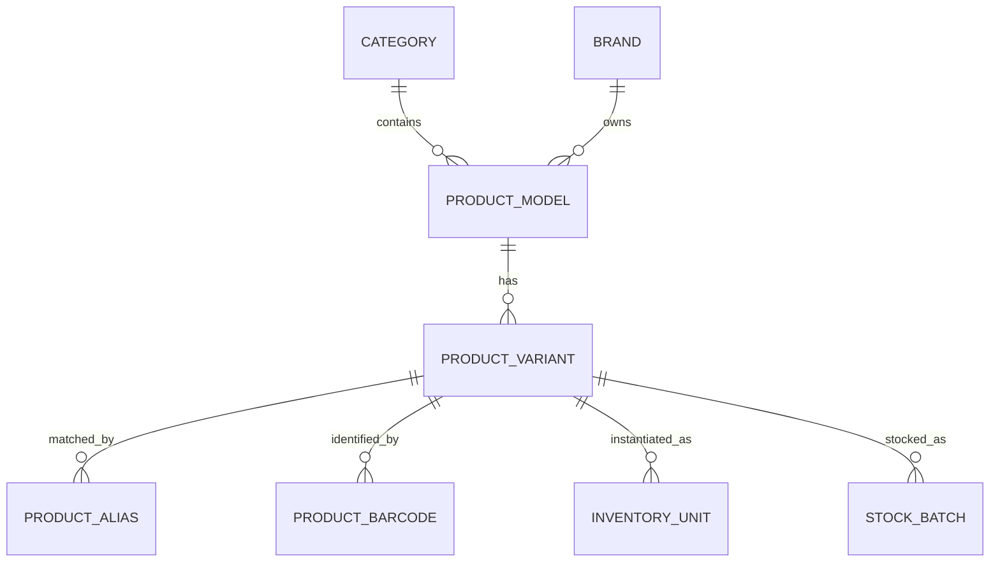
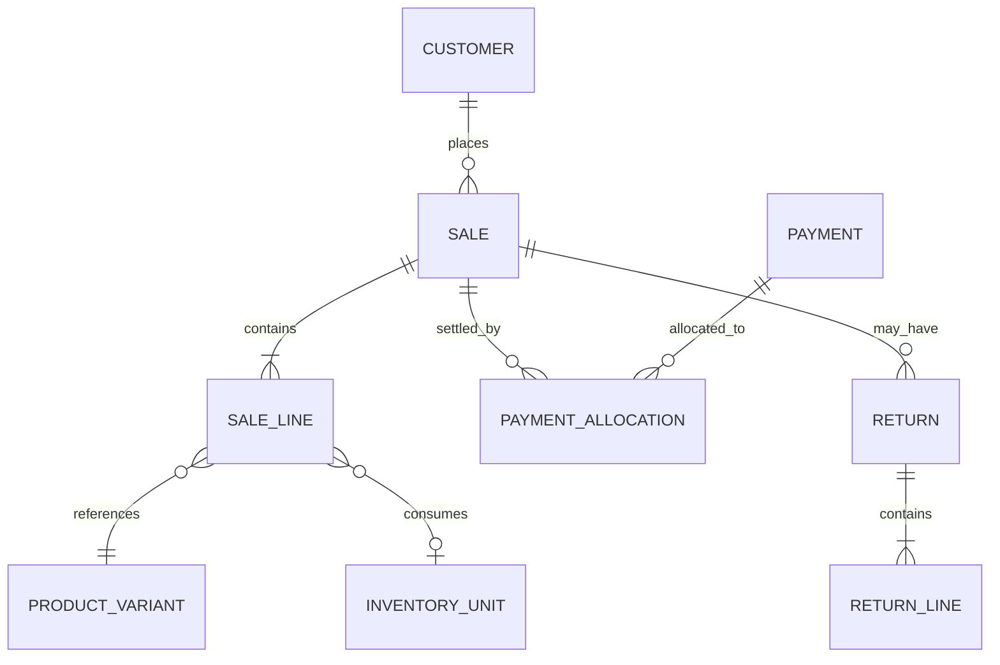

# Data Model

## 1. Modeling principles

- Separate catalog definitions from physical inventory.
- Treat every serialized device as a unique inventory unit.
- Treat stock changes as movements, not editable counters.
- Treat posted sales, purchases and payments as immutable business records.
- Include organization, branch and location boundaries where relevant.
- Keep audit, integration and recommendation history.
- Use integer minor units for money.
- Use Asia/Karachi for display while storing timestamps consistently.

## 2. Core entities

### Organization and access
- Organization
- Branch
- StockLocation
- User
- Role
- Permission
- UserRole
- CashSession

### Catalog
- Category
- Brand
- ProductModel
- ProductVariant
- ProductAlias
- ProductAttribute
- ProductBarcode
- CompatibilityRule
- PriceList
- PriceEntry

### Inventory
- InventoryUnit
- StockBatch
- InventoryMovement
- Reservation
- StockCount
- StockAdjustment
- DeviceVerification
- DeviceInspection
- InventoryPhoto

### Customers and demand
- Customer
- CustomerAddress
- CustomerConsent
- DemandRequest
- DemandRequestItem
- FollowUp
- Quotation

### Suppliers and purchasing
- Supplier
- SupplierContact
- SupplierProduct
- SupplierQuote
- PurchaseOrder
- PurchaseOrderLine
- GoodsReceipt
- GoodsReceiptLine
- PurchaseReturn
- SupplierPayment
- Payable

### Sales and finance
- Sale
- SaleLine
- Payment
- PaymentAllocation
- Return
- ReturnLine
- Refund
- Expense
- ExpenseCategory
- Receivable
- CashMovement
- OwnerEquityMovement

### Used devices, warranty and repairs
- UsedDeviceIntake
- SellerDeclaration
- WarrantyClaim
- RepairJob
- RepairPart
- RepairStatusHistory

### Intelligence and system
- DailyProductMetric
- RecommendationRun
- PurchaseRecommendation
- RecommendationDecision
- Notification
- Task
- IntegrationAttempt
- Document
- AuditEvent
- OutboxEvent

## 3. Catalog hierarchy

Example:

- Category: Smartphones
- Brand: Apple
- ProductModel: iPhone 17 Pro Max
- ProductVariant: 256 GB / Black / PTA-approved / New
- InventoryUnit: physical device with IMEI1 and actual purchase cost

PTA status and condition may be variant-level for sellable grouping, but final verified status must also exist on the physical inventory unit.

## 4. Serialized inventory

`InventoryUnit` suggested fields:

- id
- organization_id
- branch_id
- location_id
- product_variant_id
- sku
- barcode
- imei1
- imei2
- serial_number
- condition
- stock_state
- ownership_state
- PTA_status
- PTA_verified_at
- PTA_verification_reference
- police_verification_status
- police_verification_reference
- purchase_order_line_id
- goods_receipt_line_id
- acquired_at
- unit_cost_minor
- landed_cost_minor
- list_price_minor
- warranty_type
- warranty_start
- warranty_end
- battery_health
- grade
- risk_flags
- version
- created_at
- updated_at

Unique constraints:

- organization + normalized IMEI1
- organization + normalized IMEI2 when present
- organization + serial_number when present

## 5. Non-serialized inventory

`StockBatch` tracks received quantities and cost layers. `InventoryMovement` is the source of quantity changes.

Movement types:

- purchase_receive
- sale
- sale_return
- purchase_return
- transfer_out
- transfer_in
- reserve
- release
- adjustment_in
- adjustment_out
- damage
- write_off
- repair_issue
- repair_return

For performance, a stock-balance table may be maintained transactionally or rebuilt from movements. The movement ledger remains authoritative.

## 6. Sales model

Store snapshots on `SaleLine`:

- product name
- SKU
- IMEI/serial
- quantity
- unit price
- discount
- tax
- actual COGS
- gross profit
- warranty terms

Snapshots preserve historical truth when catalog data changes later.

## 7. Purchasing model

A purchase order is commercial intent. A goods receipt is the actual arrival of stock. A supplier invoice/payable is the financial obligation.

Do not mark stock available merely because a PO is approved.

## 8. Demand model

`DemandRequest` represents the customer interaction. `DemandRequestItem` stores requested product details.

Fields:

- matched_product_variant_id, nullable
- raw_request_text
- desired brand/model
- RAM/storage/color
- condition preference
- PTA preference
- budget_min/max
- quantity
- urgency
- outcome
- lost_reason
- available_at_request
- quoted_price
- dedupe_group_id
- request channel
- follow-up date

Unmatched requests must remain usable. A later catalog match should not erase the original wording.

## 9. Recommendation model

`RecommendationRun`:

- scope
- period start/end
- algorithm version
- configuration snapshot
- budget
- generated_by
- generated_at

`PurchaseRecommendation`:

- product_variant_id or product family
- available
- reserved
- inbound
- sales windows
- unmet demand
- stockout days
- lead time
- forecast demand
- safety stock
- target stock
- suggested quantity
- estimated cost
- expected gross profit
- score
- confidence
- reasons JSON
- risks JSON

`RecommendationDecision`:

- accepted/reduced/increased/deferred/rejected
- final quantity
- reason
- user
- timestamp
- purchase_order_id

## 10. Audit model

`AuditEvent` fields:

- id
- occurred_at
- actor_user_id
- organization_id
- branch_id
- action
- entity_type
- entity_id
- before_hash or safe snapshot
- after_hash or safe snapshot
- reason
- request_id
- IP/device metadata where appropriate
- sensitivity classification

Do not store secrets or full sensitive documents in the audit payload.

## 11. Data retention

- Posted financial and inventory records: retain according to legal/accounting policy.
- Audit records: long-term retention.
- Customer consent and contact: configurable retention.
- CNIC images and sensitive used-device documents: minimum necessary retention, restricted and encrypted.
- Deleted master data: soft delete/inactivate when referenced.
- Temporary files: automatic expiry.

## 12. Indexing priorities

- normalized IMEI1/IMEI2
- SKU/barcode
- product model/variant search
- customer normalized phone
- sale invoice/date
- purchase order/date
- movement product/location/date
- demand product/date/outcome
- recommendation run/product
- task status/due date
- audit entity/date
